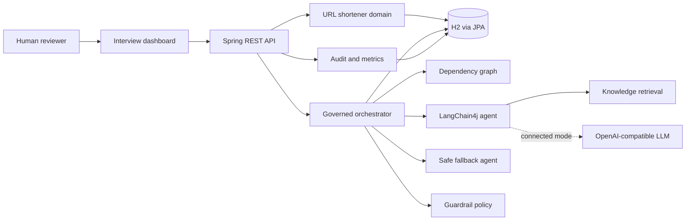
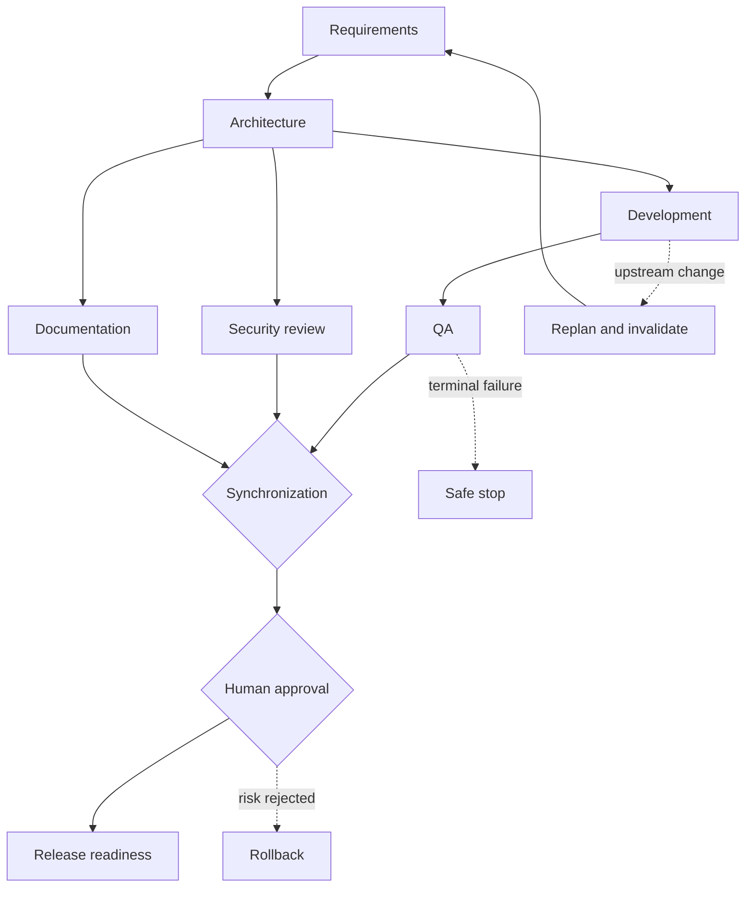

# Architecture and Decisions

## System context

## Workflow

## Defensible choices

- **Modular monolith:** easy to evaluate, with domain, AI, orchestration, policy, persistence, HTTP, and UI boundaries that can be extracted later.
- **Java 21 target:** virtual threads support concurrent ready-node execution with a conventional enterprise LTS baseline.
- **Spring Boot:** recognizable enterprise DI, HTTP, validation, actuator, JPA, and configuration conventions.
- **Typed outputs:** agents return summary, artifacts, evidence, risks, retrieved context, and mode instead of unstructured strings.
- **Provider-independent governance:** models do not decide whether they are allowed to run. The orchestrator and policy layer own dependency, approval, retry, fallback, and terminal-state rules.
- **H2 default:** zero-setup interview reliability with a direct migration path through Spring Data JPA.
- **Optional LLM:** a missing/failed credential never blocks the core demo; the UI discloses the active execution mode.
- **Local RAG:** deterministic evidence grounding without secrets. It is intentionally not described as vector search.

## Extension seams

- Replace `UrlPolicy` for DNS/private-network and enterprise reputation checks.
- Replace Spring Data repositories/configuration with PostgreSQL.
- Replace `KnowledgeService` with LangChain4j embeddings and a vector store.
- Add MCP tools behind an `AgentExecutor` implementation and enforce tool allowlists in `GuardrailPolicy`.
- Add new workflow topologies through `WorkflowGraphProvider` without changing the engine.
- Export audit and reliability telemetry through OpenTelemetry/Micrometer.

## Production limitations

The prototype still needs authenticated RBAC, approval authorization, private/link-local DNS defenses, encrypted/tamper-evident audit storage, distributed workflow locking, idempotency keys, quotas and abuse controls, secrets management, model evaluation datasets, and production vector infrastructure.
